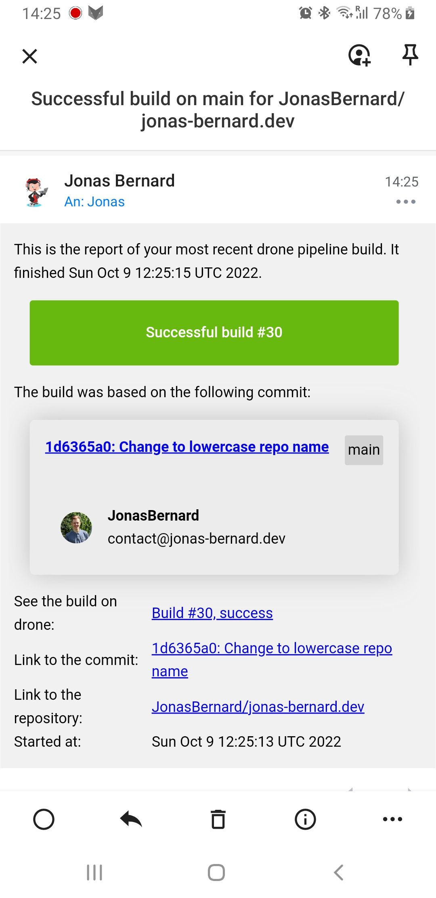
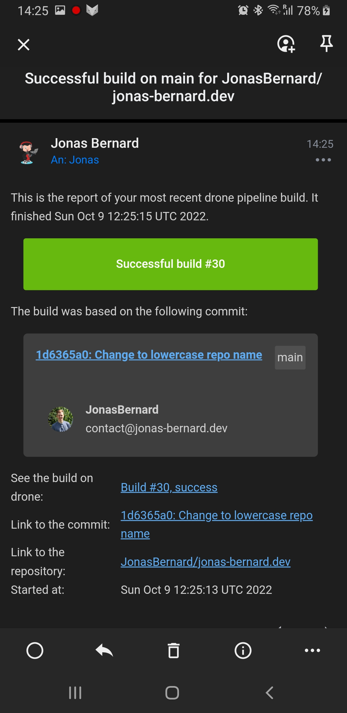
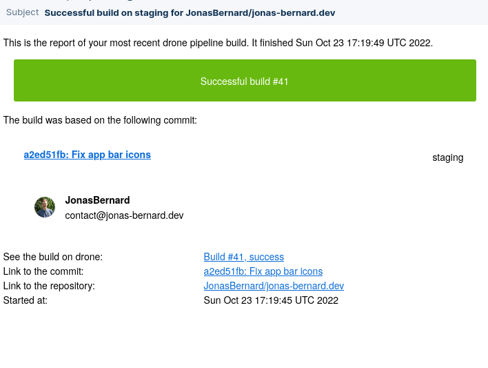
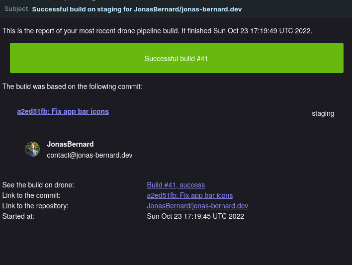

# drone-email

[](http://godoc.org/github.com/Drillster/drone-email)
[](https://goreportcard.com/report/github.com/Drillster/drone-email)

Drone plugin to send build status notifications via Email. For the usage information and a listing of the available options please take a look at [the docs](DOCS.md).

Screenshots from Spark for Android:

</img>
</img>

Screenshots from Thunderbird for Linux:

</img>
</img>

## Binary

Build the binary with the following command:

```
go build
```

## Docker

Build the docker image with the following commands:

```
docker build -t drillster/drone-email:latest .
```

Build the docker for ARM with buildx

```
docker buildx create --name mybuilder
docker buildx use mybuilder
docker buildx build --file Dockerfile.armhf --platform linux/arm64/v7,linux/arm64 -t drone-email:latest .
```

This will create a Docker image called `drillster/drone-email:latest`.
Please note incorrectly building the image for the correct x64 linux and with GCO disabled will result in an error when running the Docker image:

```
docker: Error response from daemon: Container command
'/bin/drone-email' not found or does not exist..
```

### Example
Execute from the working directory:

```sh
docker run --rm \
  -e PLUGIN_FROM.ADDRESS=drone@test.test \
  -e PLUGIN_FROM.NAME="John Smith" \
  -e PLUGIN_HOST=smtp.test.test \
  -e PLUGIN_USERNAME=drone \
  -e PLUGIN_PASSWORD=test \
  -e DRONE_REPO_OWNER=octocat \
  -e DRONE_REPO_NAME=hello-world \
  -e DRONE_COMMIT_SHA=7fd1a60b01f91b314f59955a4e4d4e80d8edf11d \
  -e DRONE_COMMIT_BRANCH=master \
  -e DRONE_COMMIT_AUTHOR=octocat \
  -e DRONE_COMMIT_AUTHOR_EMAIL=octocat@test.test \
  -e DRONE_BUILD_NUMBER=1 \
  -e DRONE_BUILD_STATUS=success \
  -e DRONE_BUILD_LINK=http://github.com/octocat/hello-world \
  -e DRONE_COMMIT_MESSAGE="Hello world!" \
  -v $(pwd):$(pwd) \
  -w $(pwd) \
  drillster/drone-email
```
